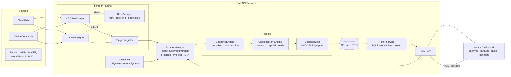
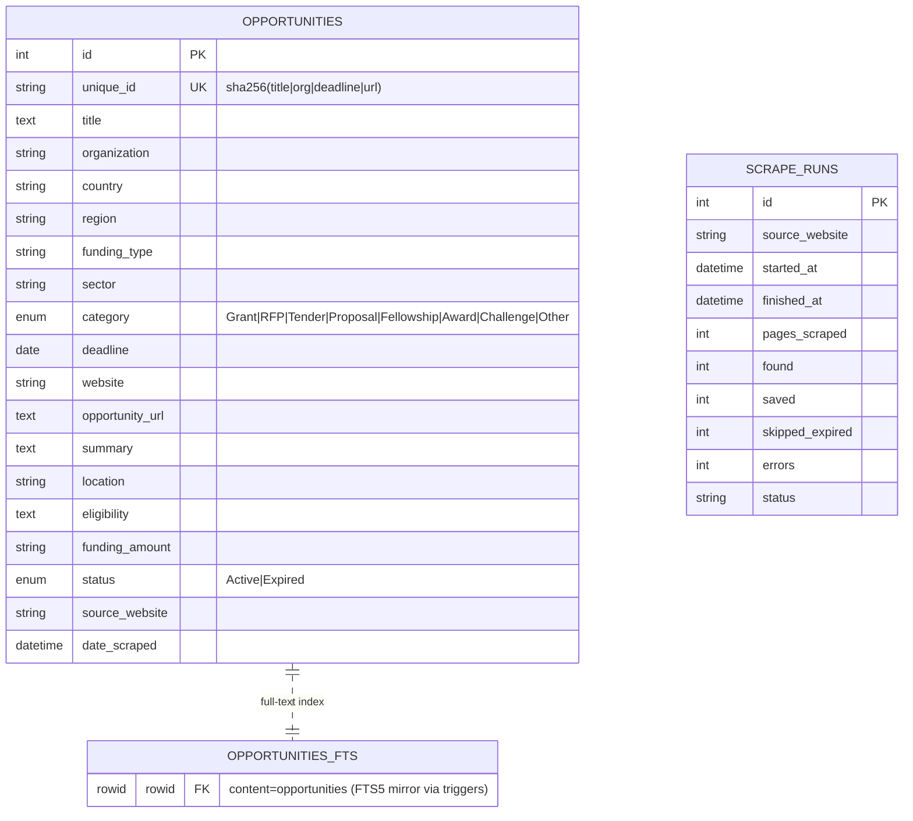
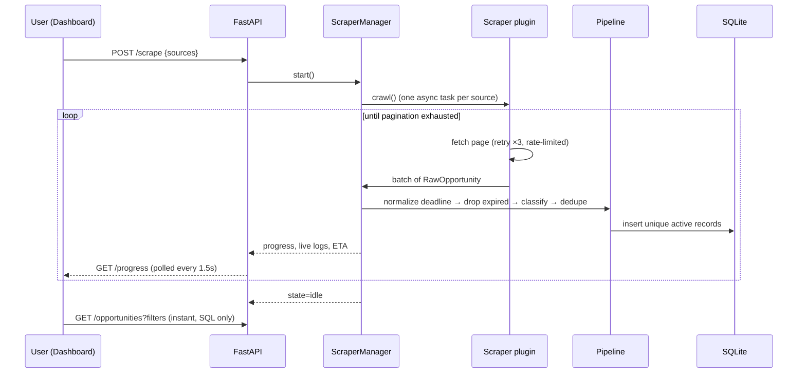

# Lead Opportunity Automation Platform

A scalable platform that automatically collects **active** funding opportunities (grants, RFPs, tenders, fellowships, awards, challenges) from multiple websites, normalizes them into one canonical model, and serves them through a FastAPI backend and a React dashboard.

**Currently supported sources**

| Source | URL | Technique |
|---|---|---|
| NGOBOX | https://ngobox.org/grant_announcement_listing.php | httpx + BeautifulSoup, auto-detected pagination links |
| DevNetJobsIndia | https://www.devnetjobsindia.org/rfp_assignments.aspx | httpx + BeautifulSoup, ASP.NET `__doPostBack` pagination (VIEWSTATE POSTs) |

Designed so 50+ more sources (FundsForNGOs, UNDP, UNICEF, World Bank, USAID, ADB, …) can be added **without changing any existing code** — one new scraper class per site.

---

## Quick start

### Backend
```bash
cd backend
python -m venv .venv && source .venv/bin/activate   # Windows: .venv\Scripts\activate
pip install -r requirements.txt
uvicorn app.main:app --reload --port 8000
```
API docs: http://localhost:8000/docs

### Frontend
```bash
cd frontend
npm install
npm run dev
```
Dashboard: http://localhost:5173 (Vite proxies `/api` → `localhost:8000`)

### Docker
```bash
docker compose up --build
```
Frontend: http://localhost:3000 · Backend: http://localhost:8000

---

## Architecture



## ER diagram



## Scrape sequence



---

## How data flows (the pipeline)

Every scraped listing passes through four stages before it can reach the database:

1. **Deadline Engine** (`services/deadline_parser.py`) normalizes free-text dates (`31 July 2026`, `31/07/2026`, `Jul 31st`, `Apply by: 15 Jul 2026`, `31.07.2026`) to `YYYY-MM-DD`. Anything with `deadline < today` — or no parseable deadline — is discarded.
2. **Classification Engine** (`services/classification.py`) scores weighted keyword matches over title (3×) and description (1×), with the source's hint worth 2 points. A grant site publishing an RFP is still classified RFP. The `Classifier` Protocol lets you swap in an ML/LLM classifier without touching orchestration.
3. **Deduplication** (`services/deduplication.py`) fingerprints `sha256(title|organization|deadline|url)` (normalized). The same opportunity found twice — same page, another page, or a re-scrape — is stored once, enforced by a DB unique constraint.
4. **Storage** — SQLite via SQLAlchemy, with an FTS5 virtual table (maintained by triggers) powering instant full-text search across 100k+ rows.

## Adding a new website (the whole point)

Create one file, e.g. `backend/app/scrapers/fundsforngos.py`:

```python
from app.scrapers.base_scraper import BaseScraper
from app.scrapers.registry import register
from app.schemas.opportunity import RawOpportunity

@register
class FundsForNGOsScraper(BaseScraper):
    name = "fundsforngos"
    display_name = "FundsForNGOs"
    website = "https://www.fundsforngos.org"
    start_url = "https://www.fundsforngos.org/category/latest-funds-for-ngos/"

    def parse_listing(self, html: str, page_url: str) -> list[RawOpportunity]:
        ...  # extract title/org/deadline/url per listing
```

Then import it in `scrapers/__init__.py`. That's it — it appears in the dashboard's website selection, `GET /sources`, and the scheduler automatically. `BaseScraper` already provides retrying HTTP, rate limiting, pagination-following (override `next_page()` for exotic pagers like ASP.NET postbacks), and pause/stop cooperation. Set `requires_js = True` for JavaScript-rendered sites and wire a Playwright fetcher (interface already present; Playwright deliberately not installed by default).

## REST API

| Method | Path | Purpose |
|---|---|---|
| GET | `/api/opportunities` | Filtered, paginated, sorted listings (all filters are query params) |
| GET | `/api/filters` | Distinct facet values for the sidebar |
| GET | `/api/stats` | Dashboard cards + charts + upcoming deadlines |
| POST | `/api/scrape` | Start scraping `{sources: []}` (empty = all) |
| POST | `/api/scrape/pause` · `/api/scrape/resume` | Pause / resume |
| POST | `/api/stop` | Graceful stop |
| GET | `/api/progress` | State, %, ETA, per-source counters, live logs |
| GET | `/api/sources` | Registered scraper plugins |
| GET/PUT | `/api/schedule` | Manual / daily / weekly / monthly / cron |
| GET | `/api/export/csv` · `/api/export/xlsx` | Export the *currently filtered* set |
| GET | `/api/health` | Liveness |

## Project layout

```
backend/
  app/
    core/          config (env-driven), logging (scraper/errors/performance logs)
    database/      SQLAlchemy models, engine, FTS5 setup
    schemas/       Pydantic models (RawOpportunity, API contracts)
    scrapers/      base_scraper.py, registry.py, ngobox.py, devnet.py
    services/      scraper_manager, classification, deadline_parser,
                   deduplication, filter_service, export_service, scheduler
    api/           routes.py (thin controllers)
    main.py        FastAPI app + lifespan
frontend/
  src/
    components/    dashboard UI (+ ui/ primitives, shadcn-style)
    hooks/         data fetching, progress polling
    lib/           api client, types, utils
docker-compose.yml
```

## Design notes

- **SOLID**: scrapers follow Open/Closed via the plugin registry; pipeline stages are injected into `ScraperManager` (swap the classifier without edits); routes are thin controllers over services.
- **Resilience**: every fetch retries 3× with exponential backoff, then the *page* is skipped — never the run. Parse errors skip the page. A crashing source never takes down the others (isolated async tasks).
- **Pagination**: discovered from each page (rel=next, numbered links, or ASP.NET postback targets). Loop guards: repeated-URL detection, empty-page stop, and a configurable safety cap (default 2000 pages/source).
- **Politeness**: per-source rate limiting (1 req/s default) + bounded concurrency (4/source) — tune via `LOP_RATE_LIMIT_DELAY`, `LOP_CONCURRENCY_PER_SOURCE`.
- **Incremental updates**: `scrape_runs` records every run; dedup makes re-scrapes cheap (duplicates are skipped, only new records insert).
- **Future-ready**: the canonical model + service layer leave room for AI ranking, lead scoring, email alerts, saved searches, user accounts, semantic search, and CRM/Power BI integration without core changes (add services/routes; swap SQLite for Postgres by changing `LOP_DATABASE_URL`).

## Team & lead routing (email digests)

Add team members in the dashboard's **Team & Lead Routing** panel with interest keywords
(e.g. `climate, environment`) and optional categories (e.g. Grant, RFP). Then:

- **Send button** — emails that member every *new* active opportunity matching their interests.
  Already-sent items are never repeated (tracked in `sent_log`).
- **Auto-digest** — after every completed scrape (manual or scheduled), members with
  auto-send enabled automatically receive any new matches. Combined with a daily schedule,
  this means: scrape at 2 AM → matching climate grants land in your teammate's inbox at 2 AM.

### One-time email setup (Gmail)
1. Go to https://myaccount.google.com/apppasswords (requires 2-Step Verification to be on).
2. Create an app password named "Lead Platform" — Google shows a 16-character code.
3. Copy `backend/.env.example` to `backend/.env` and fill in:
   ```
   LOP_SMTP_USER=you@gmail.com
   LOP_SMTP_PASSWORD=the-16-char-code
   ```
4. Restart the backend. The yellow warning in the Team panel disappears.

Other providers work too — override `LOP_SMTP_HOST` / `LOP_SMTP_PORT` (defaults: smtp.gmail.com:587).

Team API: `GET/POST /api/team`, `PUT/DELETE /api/team/{id}`, `GET /api/team/{id}/matches`,
`POST /api/team/{id}/send`, `GET /api/email/status`.

## Configuration

All via environment variables (or `backend/.env`): `LOP_DATABASE_URL`, `LOP_RATE_LIMIT_DELAY`, `LOP_CONCURRENCY_PER_SOURCE`, `LOP_MAX_RETRIES`, `LOP_MAX_PAGES_SAFETY_CAP`, `LOP_CORS_ORIGINS`.

## Deployment

- **Docker (recommended):** `docker compose up --build -d`. SQLite data persists in the `opportunity-data` volume; logs land in `backend/logs/`.
- **Bare metal:** run uvicorn behind nginx/caddy; `npm run build` and serve `frontend/dist` statically; point `/api` at uvicorn.
- **Scaling up:** switch `LOP_DATABASE_URL` to Postgres, run multiple uvicorn workers, and move scrape jobs to a task queue (Celery/ARQ) when you pass ~100 sources.
